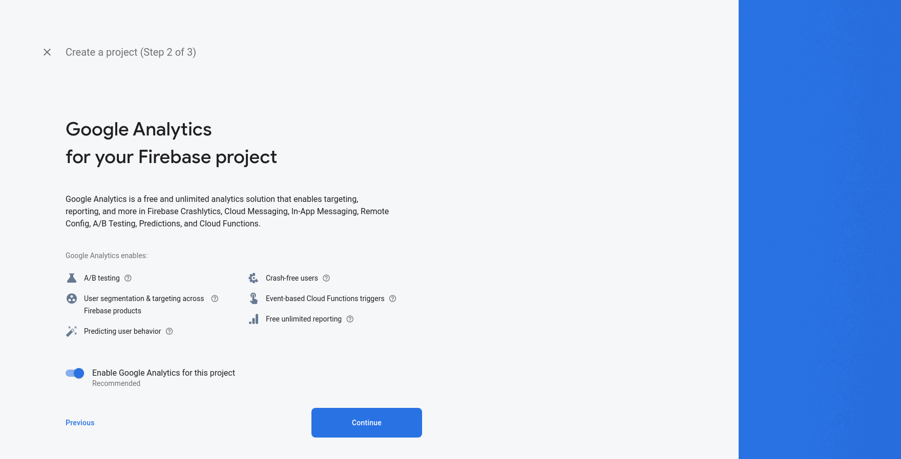
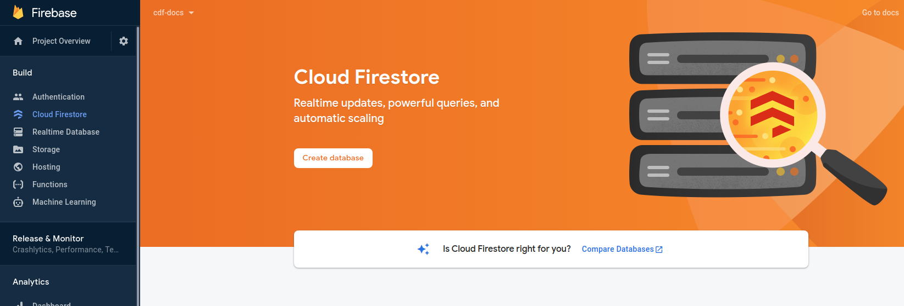
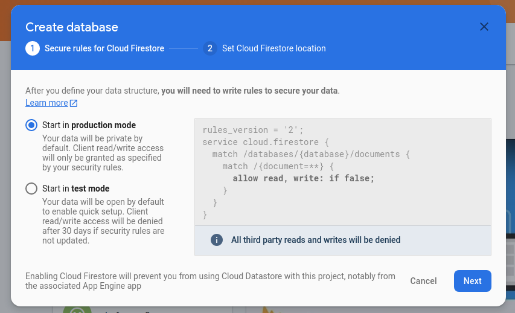
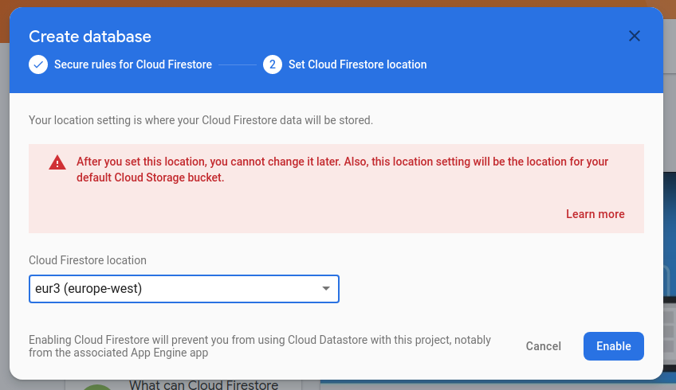
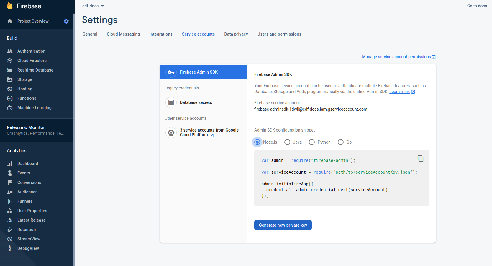

# Data Stores

## badger

[badger](https://github.com/dgraph-io/badger) is the default database driver for `cfd`. Badger is an embeddable and fast key-value database written in Go.

Use this database if using a local development machine for simplicity (you don't need to modify the configuration file to start using it). If you can live with just one server for the API, this setup will be reliable enough for a moderated size of clients.

**Backup**: Copy full content of the selected database directory.

**Restore**: Just copy the back up back and start the service.

>The service needs to be stopped to ensure back up and restore, `badger` *locks data files* making the process to (normally) fail.

#### Configuration

All configuration resides on the `config.yaml` file (or whatever other name you selected).

>[!INFO]
>`type` must be set to `badger`.
>
>`connection` is the directory where the data will be stored.

```yaml
db:
  connection: /your_home_directory/.cfd/db
  type: badger
```

## firebase (firestore)

[firebase](https://firebase.google.com/) is a backend service by Google that helps building applications.

Firebase has generous limits on its free plan so unless you are creating a big amount of certificates it will remain free *(you need to store more than 1Gb of data, write more than 20.000 docs/day or read more than 50.000 docs/day to pass the limits)*. Review firebase [pricing](https://firebase.google.com/pricing) to get full information.

>This database allows High Availability so you can run several API servers that will work with the same database storage (usually behind a load balancer).

#### Database creation

- First, you need to register in Firebase; if you have a Google account it will be a straight forward step.

- Go to the Console, and you will be prompted with a 'Create a new Project', click it. A wizard will guide you in the process.

- **Select a project name.**


- **Add Analytics if you think you will need them**

If you select to use analytics you will be asked for the project to use or set up a new one. *Refer to the Analytics documentation.*



- **Wait a few moments to project creation**


- **Go 'Cloud Firestore', Then press 'Create database'**



- **Select 'Start in production mode' to secure the data store from guests**



- **Select a location near to you.** *This cannot be changed later*



- **Database is created. Go to Project Settings**


- **Get the Firebase Admin SDK file**
  - Go to 'Service Accounts'
  - Press 'Generate new private key'
  - Save the file downloaded which will be used to identify your cfd client. Called something like `project-name-firebase-admin-sdk.json`



#### Configuration

All configuration resides on the `config.yaml` file (or whatever other name you selected).

>[!INFO]
>`type` must be set to `firestore`.
>
>`connection` is the file with firebase admin SDK configured (the one you downloaded from the service account configuration on Firebase Console).
